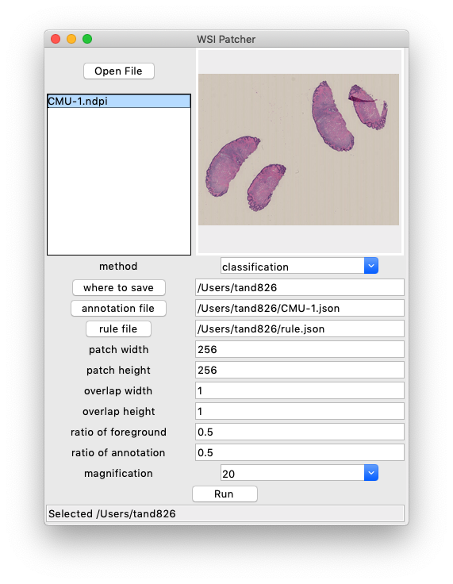

# WSIPatcher

Extract patches from whole slide images

# What is this?

- Extract patches from whole slide images with GUI.
- Running  in background.

# Installation

### Windows

1. Downlload wsipatcher_win_v0.1.zip from [releases](https://github.com/tand826/WSIPatcher/releases)
2. Download vips-dev-w64-all-8.9.1.zip from [libvips](https://github.com/libvips/libvips/releases)
3. Unzip wsipatcher-v0.1.zip and vips-dev-w64-all-8.9.1.zip
4. Make "wsipatcher" directory
5. Copy wsipatcher.exe to "wsipatcher"
6. Copy all the files in vips-dev-w64-all-8.9.1/vips-dev-w64-all-8.9.1/bin to "wsipatcher"
7. Launch wsipatcher.exe

### MacOS / Linus

1. Download wsipatcher_mac_v0.1.zip from [releases](https://github.com/tand826/WSIPatcher/releases)
2. Install libvips using homebrew or apt
3. Launch wsipatcher.exe

### Launch from command line

1. install python
2. install libvips
3. pip install -r requirements.txt
4. `python wsipatcher.py`
